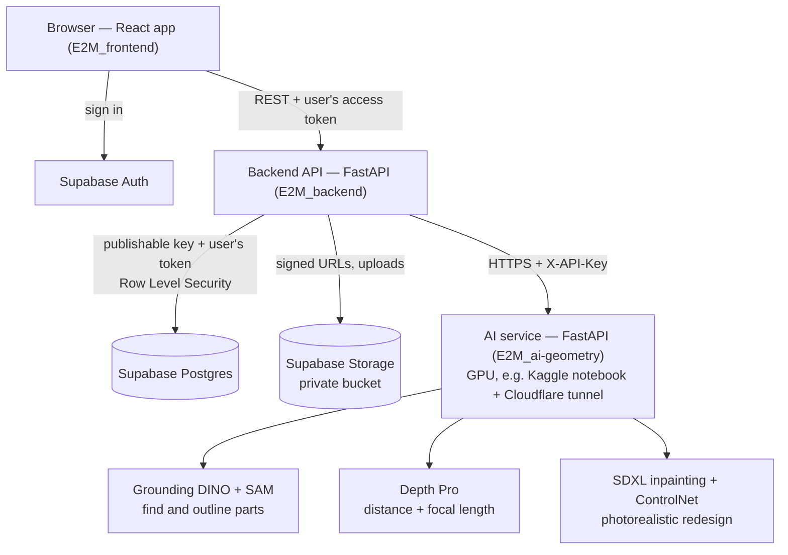
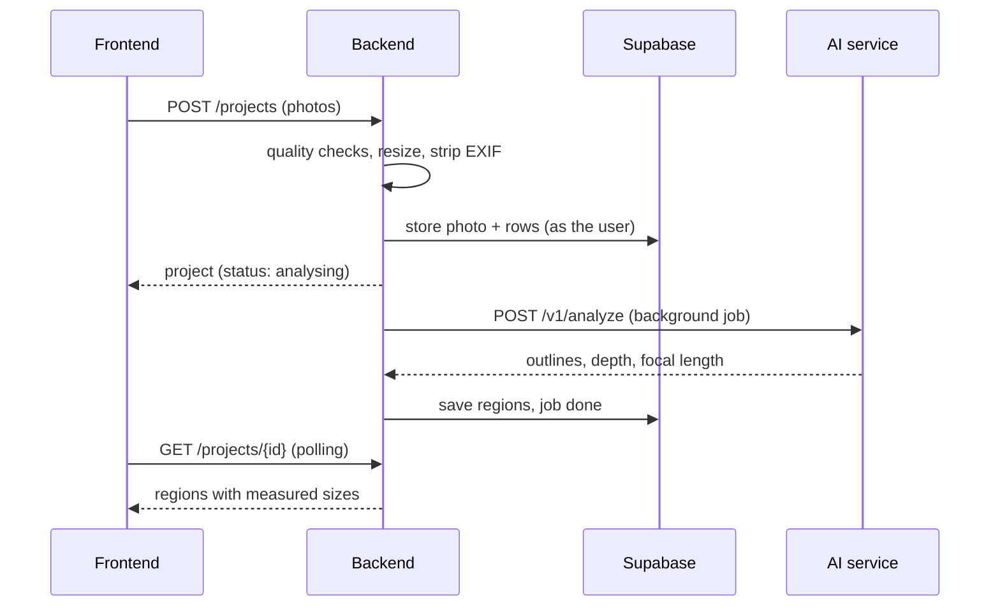

# Architecture

## Components

### Frontend (`E2M_frontend`)
React 19, Vite, Tailwind CSS. Signs users in with Supabase Auth and sends the user's access token
with every API call. Screens: projects, upload, review, materials (designs), estimate. No business
logic beyond display: every number comes from the backend.

### Backend (`E2M_backend`)
FastAPI. Owns all product logic:

| Module | Job |
|--------|-----|
| `services/images.py`, `uploads.py` | Decode, EXIF-rotate, strip metadata (incl. GPS), resize, quality-check photos |
| `services/pipeline.py`, `ai_geometry.py` | Background analysis job: send the photo to the AI service, store the regions |
| `services/measurement.py` | Turn outlines into m² / running metres (scale per photo) |
| `catalog.py` | Material catalogue (rates, coverage, wastage, suitability) |
| `services/estimate.py` | Bill of quantities, purchase quantities, costs, GST |
| `services/render.py`, `textures.py` | Standard redesign preview (CPU, ~0.3 s) |
| `services/reports/pdf.py` | PDF report (ReportLab) |
| `repositories/` | Data access: `SupabaseRepository` (production) and `MemoryRepository` (tests/offline) |

The backend holds **no database password or secret key**. It calls Supabase's Data API and Storage
with the public *publishable* key plus the signed-in user's token, so Postgres Row Level Security
decides what each request can read or write. A user can never see another user's projects, even
through a bug in the API.

Measurement, quantities and costs are recomputed on every request from the stored outlines, so an
edit (relabel, delete, exact size, rate change) shows everywhere immediately.

### AI service (`E2M_ai-geometry`)
FastAPI with two endpoints:

- `POST /v1/analyze` — photo in; labelled outlines, each region's distance and the camera focal
  length out.
- `POST /v1/render` — original, standard draft and region mask in; photorealistic JPEG out.

It is protected by a shared `X-API-Key`. All models live in one process (one GPU, one tunnel, one
key), behind separate locks for analysis and rendering so a long render does not block analysis.
Every model has a mock, so the backend and its tests run without a GPU.

### Data (Supabase)

| Table | Holds |
|-------|-------|
| `projects` | One house per project; estimate settings (GST on/off) |
| `photos` | Views (front/left/right/rear/other), primary flag, quality report, measurement reference |
| `jobs` | Background job status and errors |
| `segments` | Detected regions: label, outline, depth, user's exact size |
| `materials` | Catalogue (seeded from `catalog.py`) |
| `design_variants`, `segment_materials` | Named designs and the material + colour on each region |
| `project_rate_overrides` | Rates changed for one project only |

Photos, thumbnails and photorealistic renders are in the private `project-images` bucket, in a
folder per user, served through short-lived signed URLs.

## Request flow: analysing a photo

## Deployment

Prototype setup: frontend on Vite dev server (or any static host), backend with uvicorn,
Supabase hosted. The AI service runs in a Kaggle notebook (free T4 GPU) behind a Cloudflare quick
tunnel; the notebook prints the URL and key for the backend's `config.json`. Configuration lives
in `config.json` files (with `E2M_…` environment overrides), not in code.

Kept deliberately simple: a modular monolith per repo, no queue or worker fleet (FastAPI
background tasks), no Kubernetes. These would be the first things to add for production.
